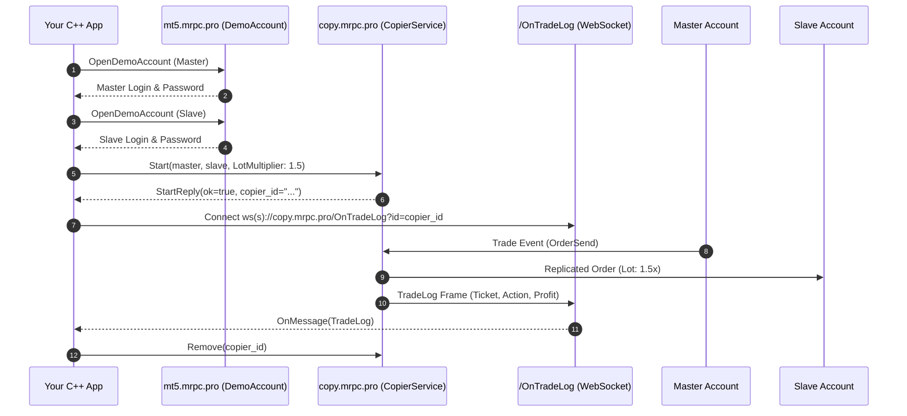

# Quick Start: Your First Project in 10 Minutes

This step-by-step tutorial walks you through building a complete trade replication application in **C++** from scratch using **CppCopier**.

---

## 1. Overview of Steps

In this guide you will:
1. **Provision two demo MetaTrader accounts** via gRPC (`DemoAccount.OpenDemoAccount`).
2. **Connect to MetaRPC Trade Copier** over HTTP/2 gRPC (`copy.mrpc.pro:443`).
3. **Start an active copier** configured with risk multipliers and SL/TP synchronization.
4. **List all registered copiers** and inspect their state.
5. **Stream real-time trade logs** via WebSocket (`/OnTradeLog?id={copierId}`).
6. **Pause and remove** the copier cleanly.

---

## 2. Complete Runnable Code

```cpp
#include <iostream>
#include <copier/copier.hpp>

int main() {
    // 1. Connect to Trade Copier gRPC Gateway
    copier::CopierService client("copy.mrpc.pro:443", "YOUR_USER_KEY");

    // 2. Define Accounts
    copier::Account master{"MT5", 10001, "demoPassword1", "MetaQuotes-Demo", "MasterAccount"};
    copier::Account slave{"MT5", 10002, "demoPassword2", "MetaQuotes-Demo", "SlaveAccount"};

    // 3. Start Copier
    copier::StartRequest req;
    req.user_key = "YOUR_USER_KEY";
        req.master = master;
    req.slave = slave;
    req.risk_type = "LotMultiplier";
    req.risk_value = "1.5";
    req.copy_sl = true;
    req.copy_tp = true;

    auto reply = client.Start(req);
    if (reply.ok) {
        std::cout << "Copier successfully started! ID: " << reply.copier_id << std::endl;
    }

    // 4. Query List
    auto list = client.List();
    for (const auto& c : list.copiers) {
        std::cout << "Active Copier: " << c.id << " (" << c.master_user << " -> " << c.slave_user << ")" << std::endl;
    }

    // 5. Pause and Remove
    client.Pause(reply.copier_id, true);
    client.Remove(reply.copier_id);
    std::cout << "Copier removed cleanly." << std::endl;
    return 0;
}
```

---

## 3. How It Works Under the Hood


